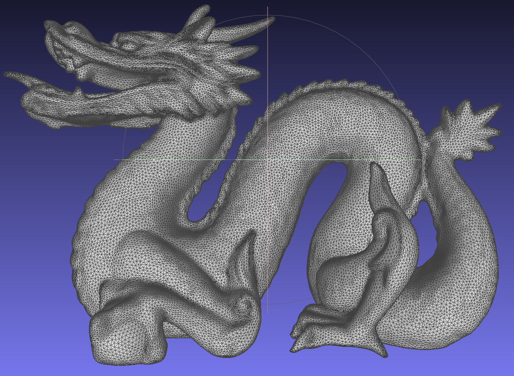
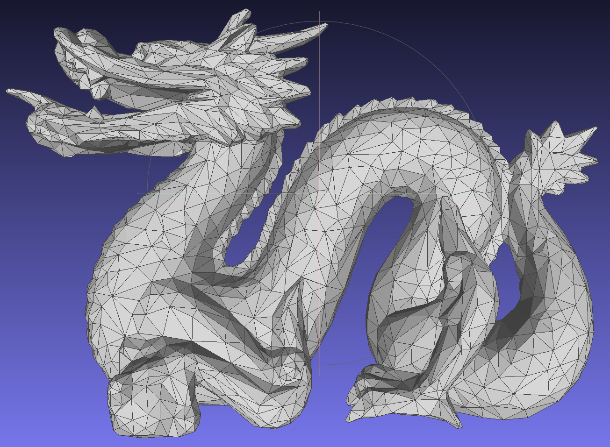

# 作业三报告

## 项目概要

https://github.com/xalanq/mesh_simplification

### 环境

整个项目用 Rust 编写。

* cargo 1.35.0 (6f3e9c367 2019-04-04)
* rustc 1.35.0 (3c235d560 2019-05-20)
* stable-x86_64-pc-windows-msvc

### 代码结构

```
src/
-- lib.rs
-- main.rs
-- mat.rs          矩阵运算、高斯消元求逆
-- mesh.rs         网格相关功能的实现
-- vct.rs          三维向量
```

### 使用方法

```
$ ./mesh_simplification in.obj out.obj 简化比
```

## 功能实现

基于边收缩的二次误差网格简化。

令顶点度数最大为 $D$，收缩了 $T$ 条边，边 $M$ 和面 $F$ 均与顶点数 $N$ 同阶，则本算法的时间复杂度为 $O((N + TD) \log (TD + N))$，一般情况下可将 $D$ 看做常数，$T$ 与 $N$ 也同阶，那么时间复杂度则为 $O(N \log N)$。

先介绍结构体：

这是用来存储堆中边的信息的，以减小堆中元素复制的开销。

```rust
struct Edge {
    pub v1: usize,     // 顶点 1
    pub v2: usize,     // 顶点 2
    pub qv: Mat,       // v1、v2的误差矩阵之和
    pub v: Vct,        // 解出的点
    pub cost: Flt,     // 该边收缩的代价
}
```

这是堆中的状态。

```rust
struct State {
    pub cost: Flt,     // 边收缩的代价
    pub index: usize,  // Edge 数组的下标，以减少堆中数据拷贝开销
}
```

这是网格存储的信息，只包含点的位置。

```rust
type Tri = (usize, usize, usize); // 一个三角面片由 3 个点在 pos 的下标组成

pub struct Mesh {
    pub pos: Vec<Vct>,  // 点的位置数组
    pub tri: Vec<Tri>,  // 三角面数组
}
```

接下来介绍 Mesh 的一些函数。

这是用来计算平面的误差矩阵，其中 `%` 是我定义的向量叉积。整个函数的时间复杂度为 $O(1)$。

```rust
fn cal_q(v1: &Vct, v2: &Vct, v3: &Vct) -> Mat {
    let mut q = Mat::default();
    let norm = ((*v1 - *v3) % (*v2 - *v3)).norm();
    let v = [norm.x, norm.y, norm.z, -norm.dot(*v3)];
    for i in 0..4 {
        for j in 0..4 {
            q[i][j] = v[i] * v[j];
        }
    }
    q
}
```

接着是最主要的函数 `pub fn simplify(&self, ratio: Flt) -> Self`

首先我先对每个面求出误差矩阵，然后累加到每个点上。

```rust
let mut q = vec![Mat::default(); pos.len()];   // 顶点的误差矩阵
let mut qp = Vec::with_capacity(tri.len());    // 面的误差矩阵
let mut head = vec![vec![0; 0]; pos.len()];    // 顶点相邻的面在tri中的下标

tri.iter().enumerate().for_each(|(i, &(v1, v2, v3))| {
    let qk = Self::cal_q(&pos[v1], &pos[v2], &pos[v3]);
    qp.push(qk);
    q[v1] += qk;
    q[v2] += qk;
    q[v3] += qk;
    head[v1].push(i);
    head[v2].push(i);
    head[v3].push(i);
});
```

然后将每条边都加入到堆中

```rust
let mut dele = vec![false; pos.len()];     // 某个点是否被删除，初始均未删除
let mut edge = vec![];                     // 边集
let mut heap = BinaryHeap::new();          // 二叉堆

macro_rules! test_edge {
    ($v1:expr, $v2:expr) => {
        let e = pos[$v1] - pos[$v2];
        if e.len2() >= DIST_EPS {          // 若边长大于所设阈值，则不加
            return;
        }
        let qv = q[$v1] + q[$v2];
        let inv = qv.split().inverse();     // split 是将矩阵最后一行变为 0 0 0 1
                                            // inverse 是高斯消元求逆
        let v = match inv {
            Some(inv) => Vct::new(inv[0][3], inv[1][3], inv[2][3]), // 若有逆，则得到新的顶点
            None => (pos[$v1] + pos[$v2]) * 0.5,   // 否则取中点
        };
        let cost = qv.multiply_by_vct(v);   // 这个函数算的是v^T qv v，即边的代价
        if cost >= COST_EPS {               // 若代价大于所设阈值，则不加
            return;
        }
        edge.push(Edge::new($v1, $v2, qv, v, cost));   // 将边加入 edge 数组
        heap.push(State::new(cost, edge.len() - 1));   // 将新边加入堆
    };
}

tri.iter().for_each(|&(v1, v2, v3)| { // 枚举每个面，将 3 条边入堆
    test_edge!(v1, v2);
    test_edge!(v2, v3);
    test_edge!(v1, v3);
});
```

接着开始迭代堆中的边。

```rust
while let Some(state) = heap.pop() {
    let e = edge[state.index];
    if dele[e.v1] || dele[e.v2] {    // 如果某个点被删除，则这条边肯定已被删除
        continue;
    }
    let mut head_v = vec![];    // 新加的点相邻的面在tri中的下标
    let mut edge_v = vec![];    // 即将加入堆的边
```

对 `e` 这条边的两个顶点 `v1`、`v2 `相邻的面进行分类：type_a 和 type_b 边。type_a 表示面中仅包含了 `v1` 或 `v2`，type_b 表示面中同时包含了这两个顶点。

```rust
// 只有一个顶点是v1的三角形
macro_rules! type_a {
    ($i:expr, $v1:expr) => {
        if tri[$i].1 == $v1 { // 找出是 v1 的那个顶点并交换到第一个位置上
            tri[$i] = (tri[$i].1, tri[$i].2, tri[$i].0);
        } else if tri[$i].2 == $v1 {
            tri[$i] = (tri[$i].2, tri[$i].0, tri[$i].1);
        }
        let (v2, v3) = (tri[$i].1, tri[$i].2);
        let qk = Self::cal_q(&pos[v], &pos[v2], &pos[v3]); // 计算新的点和另两个顶点的误差矩阵
        let dq = qk - qp[$i];
        head_v.push($i);
        q[v] += qk;         // 将 3 个点的贡献更新
        q[v2] += dq;
        q[v3] += dq;
        qp[$i] = qk;        // 直接将旧的面替换成新的面
        tri[$i].0 = v;
        edge_v.push(v2);    // 加入v要相连的点到候选数组里，等待合并完了再连边
        edge_v.push(v3);
    };
}

// 有两个顶点是v1和v2的三角形
macro_rules! type_b {
    ($i:expr, $v1:expr, $v2:expr) => {
        let v3 = tri[$i].0 + tri[$i].1 + tri[$i].2 - $v1 - $v2; // 得到第三个点的下标
        q[v3] -= qp[$i];    // 直接删除这个面
        edge_v.push(v3);    // 加入点到候选数组
    };
}
```

然后边

```rust
    macro_rules! in_tri {         // $v 点是否在 $i 这个面内
        ($i:expr, $v:expr) => {
            tri[$i].0 == $v || tri[$i].1 == $v || tri[$i].2 == $v
        };
    }

    macro_rules! is_valid_tri {   // 一个面的三个顶点必须都没被删除
        ($i:expr) => {
            !(dele[tri[$i].0] || dele[tri[$i].1] || dele[tri[$i].2])
        };
    }

    head[e.v1].iter().for_each(|&i| {    // 枚举v1相邻的面，同时
        if is_valid_tri!(i) {
            if !in_tri!(i, e.v2) {
                type_a!(i, e.v1);
            } else {
                type_b!(i, e.v1, e.v2);
            }
        }
    });
    head[e.v2].iter().for_each(|&i| {    // 枚举v2相邻的面，此时只统计type_a，因为type_b前面统计了
        if is_valid_tri!(i) && !in_tri!(i, e.v1) { 
            type_a!(i, e.v2);
        }
    });
    dele[e.v1] = true; // 然后将这两个点删除
    dele[e.v2] = true;
    // 候选点的 dele 一定是 false，所以利用这一点用 dele 数组作为是否已经加过该边的标记
    edge_v.iter().for_each(|&vi| {
        if !dele[vi] { // 没有加过 v - vi 这条边，则加边并标记
            test_edge!(v, vi);
            dele[vi] = true;
        }
    });
    edge_v.iter().for_each(|&vi| {  // 将所有的候选点的标记全部去掉
        dele[vi] = false;
    });
    head.push(head_v);
}
```

至此，算法结束（至于如何根据简化比控制结束，就是删一条边 = 删两个面，然后计数一下停止就行）。

可以发现，我并没有在堆中删除边的操作，只是记录点是否被删除来排除掉堆中已被删除的边。

## 效果

速度特别快，所给的模型基本都是秒出。

龙



简化比 0.1


简化比 0.03



## 拓展功能

咱也不会，咱也不敢说，搜了下论文发现有点复杂，故作罢。
